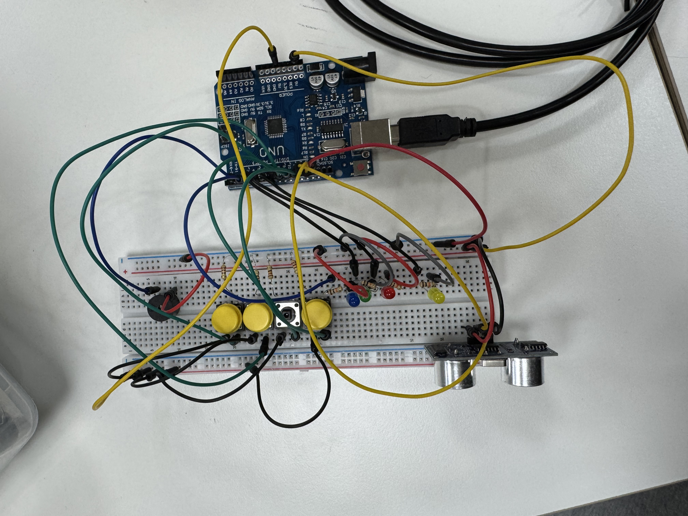

# 아두이노

이 걸작은 **엄청난** 기능이 들어간 작품입니다.

걸작을 만든 이유는 초음파 센서, 부저 그리고 LED를 사용하고 싶었습니다.

결과적으로 들어간 부품은 초음파 센서, 부저, LED 그리고 스위치가 들어갔습니다.

**하드웨어** 사진입니다.

 걸작에 들어간 기능은 초음파 센서가 10cm 이내에 물체가 있으면 울리고 LED도 켜집니다.
 
그리고 스위치를 누르면 LED가 켜집니다.

**소프트웨어** 사진입니다.

 LED 안켜짐, 부저 안울림 이러한 어려움이 있을때마다 제 행복지수는 아래 그래프 같이 하락증세를 보이고 있습니다.
 
하지만 어려움을 극복하고 성공한 순간 제 행복지수는 거의 이 꺾은선 그래프와 비교할 수 없을만큼 엄청난 도파민을 느꼈습니다.

 이 어려움을 극복할 수 있었던 이유는 선생님의 서포트와 저의 **엄청난 지능** 과 **엄청난 창의력** 그리고 **엄청난 침착함**으로 어려움을 극복할 수 있었습니다.

